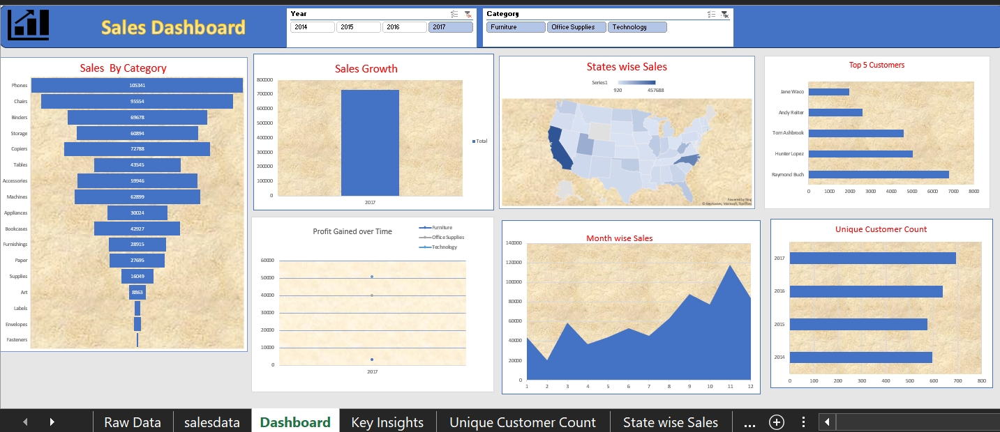

#  Sales Performance Analysis | Excel Dashboard

An interactive Microsoft Excel dashboard designed to analyze sales performance, profitability, customer trends, product categories, and regional sales.

##  Dashboard Preview

##  Project Objective

The objective of this project is to transform sales data into meaningful business insights by identifying trends across products, customers, states, and time periods.

##  Analysis Covered

- Sales by Category
- Sales Growth
- State-wise Sales
- Top 5 Customers
- Monthly Sales Trends
- Profit Analysis
- Unique Customer Count

##  Tools & Techniques

**Microsoft Excel**  
Pivot Tables • Pivot Charts • Slicers • Map Chart • Data Visualization

##  Project File

[ Download Excel Project](./Sales-Performance-Analysis-Excel.xlsx)
